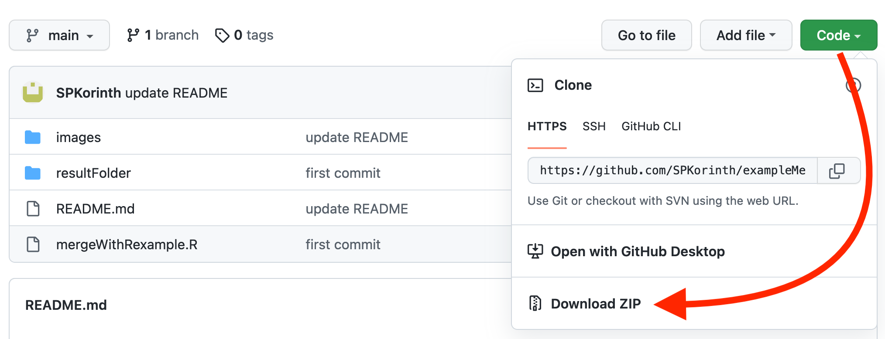

# Beispiel Skript

Im Unterordner "resultFolder" befinden sich Dummy-Dateien, mit zufällig generierten Ergebnissen. Diese 20 Dateien sollen in einem Loop zu einem R data frame vereint werden. In einem zweiten Schritt wird gezeigt, wie die so generierten Daten aus dem long ins wide Format umstrukturiert werden können.

Zum Herunterladen des Skriptes und der Beispiel-Daten hier klicken:

